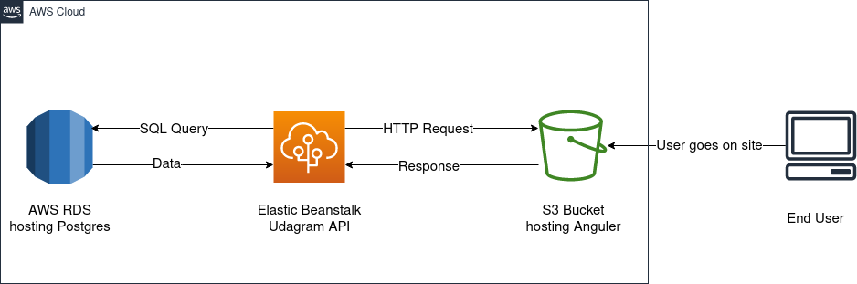
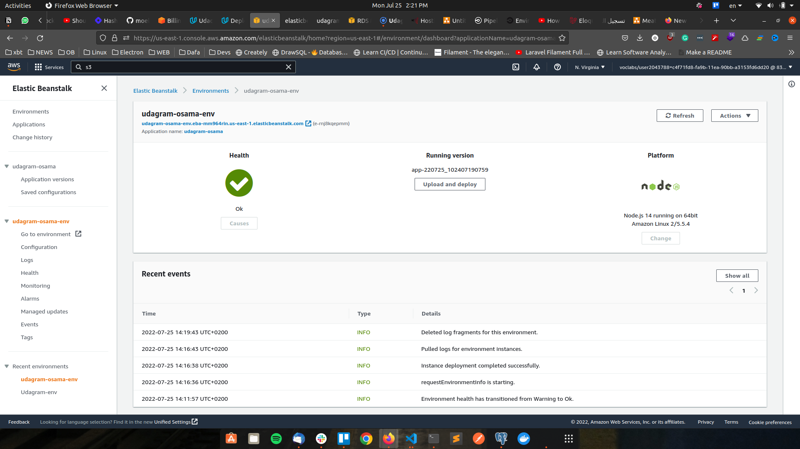
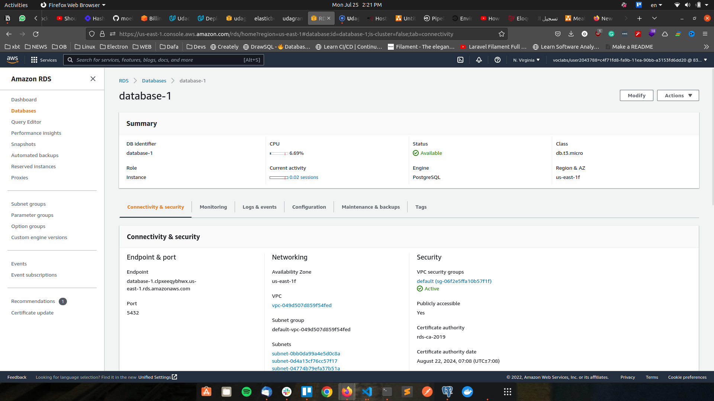
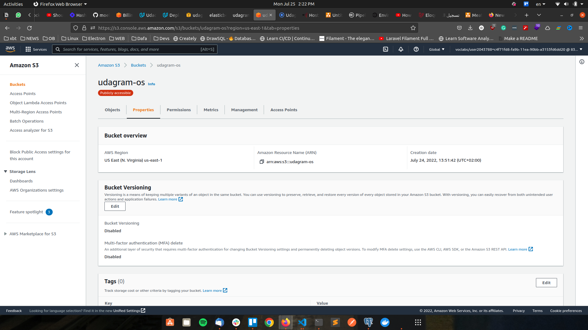
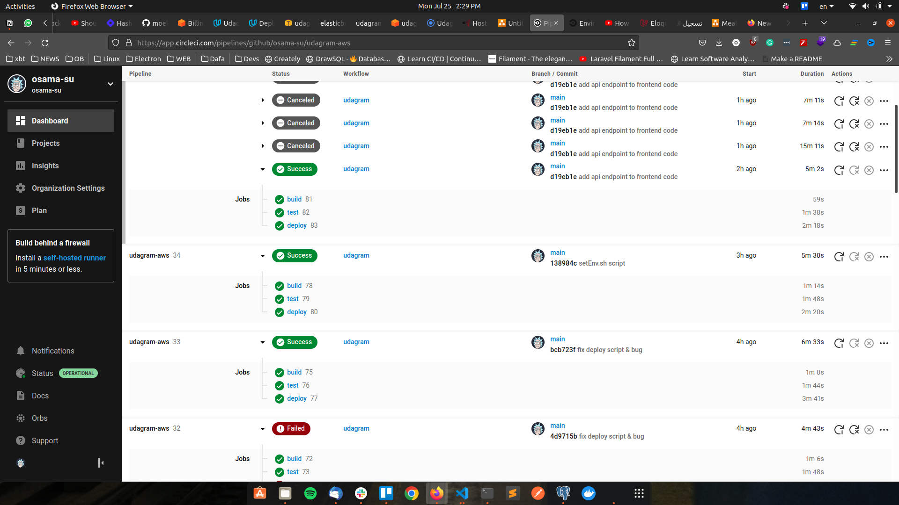

# Hosting a Full-Stack Application to AWS

# Udagram

This application is provided to you as an alternative starter project if you do not wish to host your own code done in the previous courses of this nanodegree. The udagram application is a fairly simple application that includes all the major components of a Full-Stack web application.
visit [udagram](http://udagram-os.s3-website-us-east-1.amazonaws.com)

## architecture diagram



### Dependencies

```
- Node v14.15.1 (LTS) or more recent. While older versions can work it is advisable to keep node to latest LTS version

- npm 6.14.8 (LTS) or more recent, Yarn can work but was not tested for this project

- AWS CLI v2, v1 can work but was not tested for this project

- A RDS database running Postgres.

- A S3 bucket for hosting uploaded pictures.

```

### Installation

Provision the necessary AWS services needed for running the application:

1. In AWS, provision a publicly available RDS database running Postgres. <Place holder for link to classroom article>
1. In AWS, provision a s3 bucket for hosting the uploaded files. <Place holder for tlink to classroom article>
1. Export the ENV variables needed or use a package like [dotnev](https://www.npmjs.com/package/dotenv)/.
1. From the root of the repo, navigate udagram-api folder `cd starter/udagram-api` to install the node_modules `npm install`. After installation is done start the api in dev mode with `npm run dev`.
1. Without closing the terminal in step 1, navigate to the udagram-frontend `cd starter/udagram-frontend` to intall the node_modules `npm install`. After installation is done start the api in dev mode with `npm run start`.

### CIRCLE CI

- Environment Variables

| Name                   |                          Value                          |
| ---------------------- | :-----------------------------------------------------: |
| AWS_DEFAULT_REGION     |   The AWS region you used to provision RDS, S3 and EB   |
| AWS_ACCESS_KEY_ID      |                 Your AWS Access key ID                  |
| AWS_SECRET_ACCESS_KEY  |               Your AWS secret Access key                |
| AWS_S3_ENDPOINT        |              The url of the S3 hosted app.              |
| AWS_PROFILE            |                    Your AWS profile                     |
| AWS_BUCKET             |  The name of the S3 bucket used to host the front end   |
| ---------------------- | ------------------------------------------------------- |
| POSTGRES_HOST          |          The url of the RDS database instance           |
| POSTGRES_DB            |                        postgres                         |
| POSTGRES_USERNAME      |  The username specified when creating the RDS instance  |
| POSTGRES_PASSWORD      |  The password specified when creating the RDS instance  |
| DB_PORT                |   The port of the RDS db instance (5432 for postgres)   |

### AWS

- Create IAM user with `AdministratorAccess`

- Configure the aws cli user with your terminal via `aws configure`

### Create S3 Bucket

- open terminal and run the following to create s3 bucket

```bash
aws s3api create-bucket \
           --bucket udagram-os \
           --region us-east-1
```

- Set Bucket Policy for S3 Bucket

make sure u change `NAME_OF_YOUR_BUCKET` with your bucket name in my case will be `udagram-os`

```json
{
  "Version": "2012-10-17",
  "Statement": [
    {
      "Sid": "PublicReadGetObject",
      "Effect": "Allow",
      "Principal": "*",
      "Action": ["s3:GetObject"],
      "Resource": ["arn:aws:s3:::NAME_OF_YOUR_BUCKET/*"]
    }
  ]
}
```

- in your s3 bucket properties go to static website hosing and enable it.

- you should have a url for example `http://udagram-os.s3-website-us-east-1.amazonaws.com/`

- now it's time to upload you static files and this can be by

```bash
aws s3 sync build/ s3://udagram-os
```

Delete all resource after you finish

```bash
aws s3 rb s3://udagram-os --force
```

## Testing

This project contains two different test suite: unit tests and End-To-End tests(e2e). Follow these steps to run the tests.

1. `cd starter/udagram-frontend`
1. `npm run test`
1. `npm run e2e`

There are no Unit test on the back-end

### Unit Tests:

Unit tests are using the Jasmine Framework.

### End to End Tests:

The e2e tests are using Protractor and Jasmine.

## Deployment

CI/CD (Continuous Integration/Continuous Delivery) Principles.
using CircleCI.

## Elastic Beanstalk



## RDS Database



## S3 Bucket



## CircleCI



## Built With

- [Angular](https://angular.io/) - Single Page Application Framework
- [Node](https://nodejs.org) - Javascript Runtime
- [Express](https://expressjs.com/) - Javascript API Framework
- [Postgres](https://www.postgresql.org/) - Database Framework
- [AWS](https://aws.amazon.com/) - Cloud Platform
- [TypeScript](https://www.typescriptlang.org/) - Javascript Compiler
- [CircleCI](https://circleci.com/) - Continuous Integration Platform

## License

[License](LICENSE.txt)
